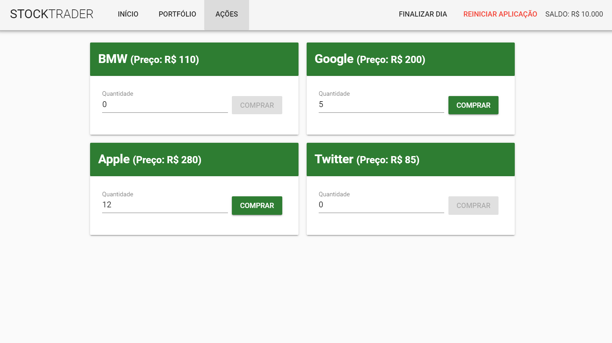

<h1 align="center">
  :heavy_dollar_sign: StockTrader :heavy_dollar_sign:
</h1>

<h4 align="center">
  A web application where users can buy stocks and sell them to have profit
</h4>

<p align="center">
  
  
</p>

<p align="center">
  <a href="#technologies">Used Technologies</a>&nbsp;&nbsp;&nbsp;|&nbsp;&nbsp;&nbsp;
  <a href="#objective">The project's objective</a>&nbsp;&nbsp;&nbsp;|&nbsp;&nbsp;&nbsp;
  <a href="#final-result">Final Result</a>&nbsp;&nbsp;&nbsp;|&nbsp;&nbsp;&nbsp;
  <a href="#how-to-use">How to Run</a>
</p>

<p align="center">
  
</p>

<h2 id="techonologies" name="technologies">
  :rocket: Used Technologies
</h2>

#### Front-end techs:
- [Vue.js](https://br.vuejs.org) to build all the front-end in general
- [Vuex](https://vuex.vuejs.org) to manage the state of the application
- [Vuetify](https://vuetifyjs.com/en) to build the application faster without having to create a lot of components and style them
- [Sweet Alert](https://sweetalert.js.org/) to give the user friendlier alerts
- [Axios.js](https://github.com/axios/axios) to make the requests for the backend

#### Back-end techs:
- [Node.js](https://nodejs.org/en/) To build the REST API in general
- [Express.js](https://expressjs.com/) Framework for building REST APIs with Node.js
- [FileSystem Module](https://nodejs.org/api/fs.html) to save the data in a JSON file


<h2 id="objective" name="objective">
  :dart: The project's objective
</h2>

The aim of this project was practicing and fixing the concepts of Vue.js and Vuex(state manager for Vue.js apps) in my head, and also experience the process of the back-end and the front-end development in a project, I enjoyed building this app really much and I also loved the final result

<h2 id="final-result" name="final-result">
  :clipboard: Final Result
</h2>

### [You can check a little video running the app clicking here](https://youtu.be/PJwd2briE4c)

<h2 id="how-to-use" name="how-to-use">
  :information_source: How to Run
</h2>

Follow the steps below to run the application on your computed, first of all, you'll need to have these tools installed on your computer: Git, Node.js, Yarn and the Vue-CLI<br>
If you have all of these tools installed on your computer, just follow the steps below:

```bash
# Clone the repository in some directory of your computer
$ git clone https://github.com/TiagoDiass/stock-trader.git

# Enter in the repository
$ cd stock-trader

# Enter in the back-end folder
$ cd backend

# Install the dependencies
$ yarn install

# Start the backend
$ yarn start
```

After following the steps above, open another terminal on the base directory of the repo and follow the steps below:
```
# Enter in the front-end folder
$ cd frontend

# Install the dependencies
$ yarn install

# Start the frontend
$ yarn start
```

After following these steps, the terminal will show you in which port it's running, it's on the port 8080 usually, so, you'll just need to enter in your browser and
type `localhost:8080`, then you'll see the app running. When you want to stop it, go to the terminal that you used to start the app, and type <kbd>CTRL</kbd>+<kbd>C</kbd>,
this way you'll stop the app

---

Hope you enjoyed this project :smiley:<br>
:wave: [Get in touch!](https://www.linkedin.com/in/tiagodiass)

### Author: [Tiago Dias](https://tiagodiass.github.io)
